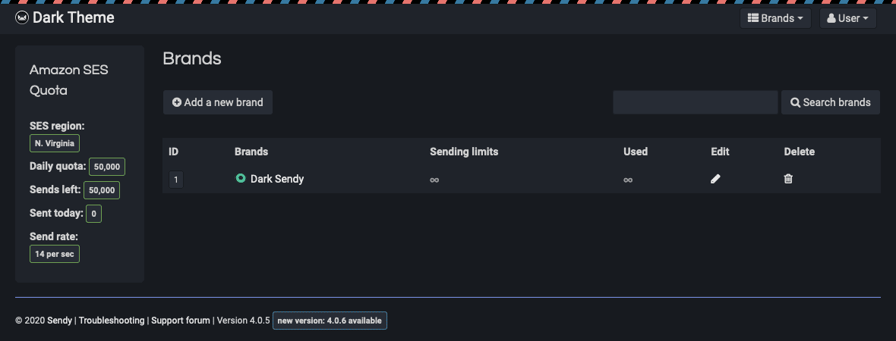

## Dark theme for Sendy

A dark theme for [Sendy](https://sendy.co).

Tested up to version 4.0.5.

**Installation**

Download `dark.css` from /dist, and put it in sendy/css/. After that, open header.php from /includes, and add the following line just before the `<title>` tag:

`<link rel="stylesheet" type="text/css" href="<?php echo get_app_info('path');?>/css/dark.css" />`

Alternatively, you could use a browser extension such as [Stylus](https://github.com/openstyles/stylus) to inject the CSS.

**Contributions**

While most of the dashboard is styled, there's probably some things I've missed. If you see you anything please open an issue or pull request.